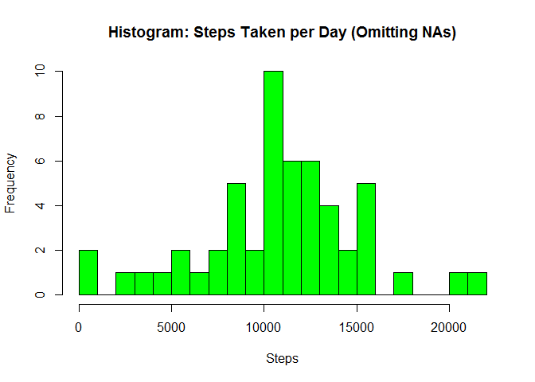
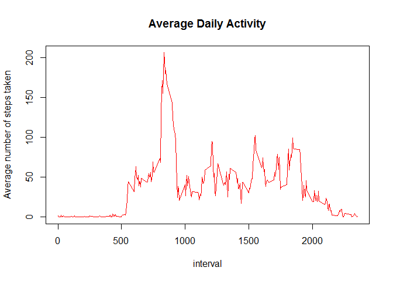
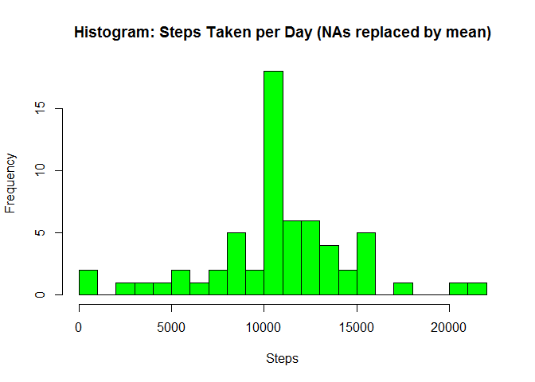
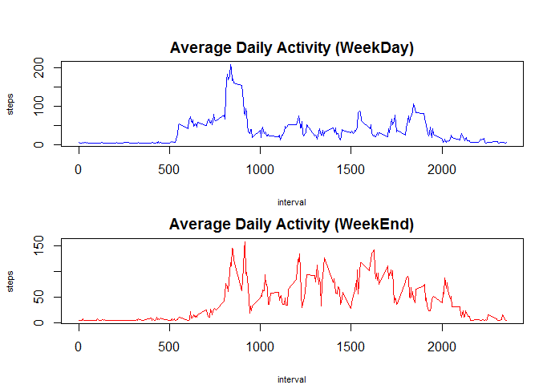

# Reproducible Research: Peer Assessment 1
# Assignment 1 (updated)
## Loading and preprocessing the data
Show any code that is needed to

-1. Load the data (i.e. read.csv())

```r
activityCSV <- read.csv("activity.csv",header = TRUE,sep = ",") #load data into activityCSV
```

-2. Process/transform the data (if necessary) into a format suitable for your analysis

```r
str(activityCSV) #structure of activityCSV
```

```
## 'data.frame':	17568 obs. of  3 variables:
##  $ steps   : int  NA NA NA NA NA NA NA NA NA NA ...
##  $ date    : Factor w/ 61 levels "2012-10-01","2012-10-02",..: 1 1 1 1 1 1 1 1 1 1 ...
##  $ interval: int  0 5 10 15 20 25 30 35 40 45 ...
```

```r
summary(activityCSV) #summary of activityCSV
```

```
##      steps                date          interval     
##  Min.   :  0.00   2012-10-01:  288   Min.   :   0.0  
##  1st Qu.:  0.00   2012-10-02:  288   1st Qu.: 588.8  
##  Median :  0.00   2012-10-03:  288   Median :1177.5  
##  Mean   : 37.38   2012-10-04:  288   Mean   :1177.5  
##  3rd Qu.: 12.00   2012-10-05:  288   3rd Qu.:1766.2  
##  Max.   :806.00   2012-10-06:  288   Max.   :2355.0  
##  NA's   :2304     (Other)   :15840
```

With the above commands, we can seee that the variable classes are of suitable formats. However, there are NAs in 'steps' variables. We will need to handle them soon.

## What is mean total number of steps taken per day?

For this part of the assignment, you can ignore the missing values in the dataset.

-1. Calculate the total number of steps taken per day

```r
activityCSV_No_NA <- activityCSV[!is.na(activityCSV$steps),] #remove NAs
steps_per_day <- aggregate(steps~date,activityCSV_No_NA,sum)
```

-2. Make a histogram of the total number of steps taken each day

```r
#Plot it!
hist(steps_per_day$steps,
     breaks = 20,
     xlab = "Steps",
     main = "Histogram: Steps Taken per Day (Omitting NAs)",
     col = "green"
)
```

 

-3. Calculate and report the mean and median of the total number of steps taken per day

```r
mean(steps_per_day$steps) #Calculating the mean
```

```
## [1] 10766.19
```

```r
median(steps_per_day$steps) #Calculating the median
```

```
## [1] 10765
```

**The mean no of steps a day is 10766.19**
**The median no of steps a day is 10765**

## What is the average daily activity pattern?

-1. Make a time series plot (i.e. type = "l") of the 5-minute interval (x-axis) and the average number of steps taken, averaged across all days (y-axis)

```r
#Calculate average steps per day
average_steps_per_day <- aggregate(steps~interval,activityCSV_No_NA,mean)

# use suitable names for column header
colnames(average_steps_per_day) <- c("Interval","Steps")

#Plot it!
plot(average_steps_per_day$Interval, average_steps_per_day$Steps,
     type = "l",
     col = "red",
     main = "Average Daily Activity",
     ylab = "Average number of steps taken",
     xlab = "interval"
     )
```

 

-2. Which 5-minute interval, on average across all the days in the dataset, contains the maximum number of steps?


```r
average_steps_per_day[which.max(average_steps_per_day$Steps),] #Calculate the max
```

```
##     Interval    Steps
## 104      835 206.1698
```

**The maximum number of steps (206.1698) occur at interval 835**

## Imputing missing values

Note that there are a number of days/intervals where there are missing values (coded as NA). The presence of missing days may introduce bias into some calculations or summaries of the data.

-1. Calculate and report the total number of missing values in the dataset (i.e. the total number of rows with NAs)

```r
activityCSV_NA <- sum(is.na(activityCSV$steps)) #activityCSV_NA is with NAs
print(activityCSV_NA)
```

```
## [1] 2304
```

**The total no of rows with NAs is 2304**


-2. Devise a strategy for filling in all of the missing values in the dataset. The strategy does not need to be sophisticated. For example, you could use the mean/median for that day, or the mean for that 5-minute interval, etc.

**Let's replace the mean for that 5-minute interval on the NA data.**

-3. Create a new dataset that is equal to the original dataset but with the missing data filled in.

```r
activityCSV2 <- activityCSV # clone activityCSV into activityCSV2
for (i in 1:ncol(activityCSV2)){
        activityCSV2[is.na(activityCSV2[,i]),i] <- 
                mean(average_steps_per_day$Steps,na.rm=TRUE) #replace NA with mean
}
```

-4. Make a histogram of the total number of steps taken each day and Calculate and report the mean and median total number of steps taken per day. Do these values differ from the estimates from the first part of the assignment? What is the impact of imputing missing data on the estimates of the total daily number of steps?

```r
steps_per_day2 <- aggregate(steps~date,activityCSV2,sum)
hist(steps_per_day2$steps,
     breaks = 20,
     xlab = "Steps",
     main = "Histogram: Steps Taken per Day (NAs replaced by mean)",
     col = "green"
)
```

 

```r
mean(steps_per_day2$steps)
```

```
## [1] 10766.19
```

```r
median(steps_per_day2$steps)
```

```
## [1] 10766.19
```

**The mean no of steps a day is 10766.19**

Imputing the data (in this method) does not change the mean.

**The median no of steps a day is 10766.19**

Imputing the data differs slightly on the median, since previously we omit the NAs altogether in calculating the median. In this method, we introduce back the NAs and put in the mean values instead. that is why the median slightly differs. Looking at the histogram, we can see now the frequency has increased for the range of 10000-11000 steps. 

## Are there differences in activity patterns between weekdays and weekends?

For this part the weekdays() function may be of some help here. Use the dataset with the filled-in missing values for this part.

-1. Create a new factor variable in the dataset with two levels - "weekday" and "weekend" indicating whether a given date is a weekday or weekend day.

It would be better for the class of 'date' variable to be converted to class 'DATE'  


```r
activityCSV2$date <- as.Date(activityCSV2$date,"%Y-%m-%d") # change class to DATE
activityCSVplus <- activityCSV2 #activityCSVplus is a copy of activityCSV2
activityCSVplus["day_type"] <- "weekday" #activityCSVplus gets a new variable 'day_type' 
#the 'day_type' contains 'weekday' by default

for (i in 1:nrow(activityCSVplus)) {
        if (weekdays(activityCSVplus[i,2])=="Saturday" |
            weekdays(activityCSVplus[i,2])=="Sunday"){
                activityCSVplus[i,4] <- "weekend" 
                # for all 'Saturday' and 'Sunday' change day_type to 'weekend'
            }
}
activityCSVplus$day_type <- as.factor(activityCSVplus$day_type)# change class to FACTOR
```


-2. Make a panel plot containing a time series plot (i.e. type = "l") of the 5-minute interval (x-axis) and the average number of steps taken, averaged across all weekday days or weekend days (y-axis). See the README file in the GitHub repository to see an example of what this plot should look like using simulated data.

```r
# for weekday
average_steps_per_weekday <- 
        aggregate(steps~interval,data = activityCSVplus, 
                  subset = activityCSVplus$day_type=="weekday", FUN = mean)
colnames(average_steps_per_weekday) <- c("Interval","Steps")

# for weekend
average_steps_per_weekend <- 
        aggregate(steps~interval,data = activityCSVplus, 
                  subset = activityCSVplus$day_type=="weekend", FUN = mean)
colnames(average_steps_per_weekend) <- c("Interval","Steps")
```

**now plot !**


```r
#panel plotting (1 for weekday, another for weekend)
par(mfrow=c(2,1), mar = c(4, 4, 2, 1), oma = c(0, 0, 2, 0))

plot(average_steps_per_weekday$Interval, average_steps_per_weekday$Steps,
     type = "l",
     col = "blue",
     main = "Average Daily Activity (WeekDay)",
     ylab = "steps",
     xlab = "interval",
     cex.lab = 0.7
     )
plot(average_steps_per_weekend$Interval, average_steps_per_weekend$Steps,
     type = "l",
     col = "red",
     main = "Average Daily Activity (WeekEnd)",
     ylab = "steps",
     xlab = "interval",
     cex.lab = 0.7
     )
```

 
